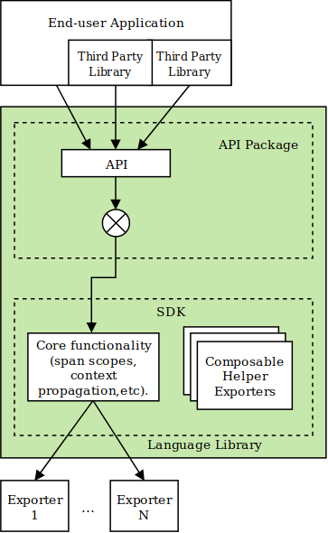

# OpenTelemetryにおける、言語ライブラリの設計原則

<!--
This document defines common principles that will help designers create language libraries that are easy to use, are uniform across all supported languages, yet allow enough flexibility for language-specific expressiveness.
-->

この文書では、使いやすく、サポートされているすべての言語で統一されているだけでなく、言語固有の表現力のために十分な柔軟性を持った言語ライブラリを作成するのに役立つ共通の原則を定義します。

<!--
The language libraries are expected to provide full features out of the box and allow for innovation and experimentation through extensibility points.
-->

言語ライブラリには、すぐに使える完全な機能と、拡張ポイントを通じて技術革新や実験を可能にすることが期待されています。

<!--
The document does not attempt to describe a language library API. For API specs see [specification](../README.md).
-->

この文書では各言語のライブラリAPIを説明しません。API仕様については [specification](../README.md) を参照してください。

<!--
_Note to Language Library Authors:_ OpenTelemetry specification, API and SDK implementation guidelines are work in progress. If you notice incomplete or missing information, contradictions, inconsistent styling and other defects please let specification writers know by creating an issue in this repository or posting in [Gitter](https://gitter.im/open-telemetry/opentelemetry-specification). As implementors of the specification you will often have valuable insights into how the specification can be improved. The Specification SIG and members of Technical Committee highly value your opinion and welcome your feedback.
-->

_言語ライブラリの作者への注釈:_ OpenTelemetryのAPIおよびSDK実装ガイドラインの仕様は策定途中です。もし不完全あるいはまだ書かれていない情報がある場合や、矛盾した表現を見つけた場合は、このリポジトリにIssueを作成するか、 [Gitter](https://gitter.im/open-telemetry/opentelemetry-specification) に投稿して仕様策定者に連絡していただけるようお願いします。あなたは仕様の実装者は仕様をどのように改善するかに関する貴重な洞察をお持ちです。仕様策定SIGと技術委員会はあなたの意見とフィードバックをお待ちしています。

## 要求

<!--
1. The OpenTelemetry API must be well-defined and clearly decoupled from the implementation. This allows end users to consume API only without also consuming the implementation (see points 2 and 3 for why it is important).
-->

1. OpenTelemetry APIは厳密に定義され、実装と明確に分ける必要があります(MUST)。これによりエンドユーザーは実装を気にせずAPIのみ使用できます(なぜこれが重要なのかは、下記の2および3を参照してください)。

<!--
2. Third party libraries and frameworks that add instrumentation to their code will have a dependency only on the API of OpenTelemetry language library. The developers of third party libraries and frameworks do not care (and cannot know) what specific implementation of OpenTelemetry is used in the final application.
-->

2. 機能を提供するサードパーティのライブラリとフレームワークは、OpenTelemetryの言語ライブラリAPIのみに依存します。サードパーティライブラリとフレームワークの開発者は、最終的なアプリケーションでOpenTelemetryのどの実装が使われているかを気にしません(そして知ることもできません)。

<!--
3. The developers of the final application normally decide how to configure OpenTelemetry SDK and what extensions to use. They should be also free to choose to not use any OpenTelemetry implementation at all, even though the application and/or its libraries are already instrumented.  The rationale is that third-party libraries and frameworks which are instrumented with OpenTelemetry must still be fully usable in the applications which do not want to use OpenTelemetry (so this removes the need for framework developers to have "instrumented" and "non-instrumented" versions of their framework).
-->

3. 通常、最終的なアプリケーションの開発者がOpenTelemetry SDK をどのように設定し、どのような拡張機能を使用するかを決めます。彼らはそのアプリケーションやライブラリがすでにOpenTelemetryを計装していたとしても、その実装を全く使わないこともできます。これはつまり、OpenTelemetryが実装されたサードパーティのライブラリやフレームワークは、OpenTelemetryを使用したくないアプリケーションからでも完全に使用可能でなければならない(MUST)ということです(これにより、フレームワークの開発者は、フレームワークの「計装済み」と「未計装」の２つのバージョンを持つ必要がなくなります)。

<!--
4. The SDK must be clearly separated into wire protocol-independent parts that implement common logic (e.g. batching, tag enrichment by process information, etc.) and protocol-dependent telemetry exporters. Telemetry exporters must contain minimal functionality, thus enabling vendors to easily add support for their specific protocol.
-->

4. SDK は、(バッチ、タグへのプロセス情報の追加など)共通のロジックを実装するワイヤプロトコルに依存しない部分と、プロトコルに依存したテレメトリーのエクスポートを行う部分とに明確に分離されている必要があります(MUST)。テレメトリー exporterは最低限の機能のみを持たなければならず(MUST)、これによりベンダーが特定のプロトコルのサポートを簡単に追加できるようになっています。

<!--
5. The SDK implementation should include the following exporters:
    - Jaeger.
    - Zipkin.
    - OpenCensus.
    - Prometheus.
    - OpenTelemetry Protocol (when the protocol is specified and approved).
    - Standard output (or logging) to use for debugging and testing as well as an input for the various log proxy tools.
    - In-memory (mock) exporter that accumulates telemetry data in the local memory and allows to inspect it (useful for e.g. unit tests).

    Note: some of these support multiple protocols (e.g. gRPC, Thrift, etc). The exact list of protocols to implement in the exporters is TBD.

    Other vendor-specific exporters (exporters that implement vendor protocols) should not be included in language libraries and should be placed elsewhere (the exact approach for storing and maintaining vendor-specific exporters will be defined in the future).
-->

5. SDK実装は以下のExporterを含むべきです(SHOULD):
    - Jaeger
    - Zipkin
    - OpenCensus
    - Prometheus
    - OpenTelemetry プロトコル (プロトコルが指定され、承認された時)
    - 標準出力 (あるいは logging)。これはデバッグおよびテストに加えて、様々なログプロキシのツールに使われます
    - メモリExporter (mock)。これはローカルメモリにテレメトリーデータを蓄えます(ユニットテストなどに便利です)

    注意: これらのうちいくつかは複数のプロトコルをサポートします(例: gRPC, Thriftなど)。Exporterの正確な実装リストは今後執筆予定です。

    他のベンダー依存のExporter(ベンダー独自のプロトコルを実装しているExporter)は言語ライブラリに含まれるべきではありません(SHOULD NOT)し、他の場所に置かれるべき(SHOULD)です(ベンダー依存のExporterを置く正確な場所は将来定義される予定です)

<!--
## Language Library Generic Design
-->

## 言語ライブラリの一般的な設計

<!--
Here is a generic design for a language library (arrows indicate calls):
-->

以下は言語ライブラリの一般的な設計の図です(矢印は呼び出しを示します):

<!--
### Expected Usage
-->

### 想定される使い方

<!--
The OpenTelemetry Language Library is composed of 2 packages: API package and SDK package.
-->

OpenTelemetry 言語ライブラリは2種類のパッケージで構成されています: APIパッケージとSDKパッケージです。

<!--
Third-party libraries and frameworks that want to be instrumented in OpenTelemetry-compatible way will have a dependency on the API package. The developers of these third-party libraries will add calls to telemetry API to produce telemetry data.
-->

OpenTelemetryと互換性がある方法で計装したいサードパーティのライブラリとフレームワークはAPIパッケージに依存します。これらサードパーティのライブラリの開発者はテレメトリーデータを作成するためにテレメトリーAPIの呼び出しを追加します。

<!--
Applications that use third-party libraries that are instrumented with OpenTelemetry API will have a choice to enable or not enable the actual delivery of telemetry data. The application can also call telemetry API directly to produce additional telemetry data.
-->

OpenTelemetry APIで計装されるサードパーティライブラリを使うアプリケーションはテレメトリーデータを実際に送信するかしないかを決めることができます。アプリケーションは追加のテレメトリーデータを作成するためにテレメトリーAPIを直接呼ぶこともできます。

<!--
In order to enable telemetry the application must take a dependency on the OpenTelemetry SDK, which implements the delivery of the telemetry. The application must also configure exporters so that the SDK knows where and how to deliver the telemetry. The details of how exporters are enabled and configured are language specific.
-->

テレメトリーを有効にするためにアプリケーションはテレメトリーを配信する機能を実装したOpenTelemetry SDKへの依存が必要です(MUST)。また、アプリケーションはテレメトリーをどこにどうやって送信するかをExporterに設定する必要があります(MUST)。どのようにExporterを有効化し、設定するかは言語によって異なります。

<!--
### API and Minimal Implementation
-->

### APIと最小実装

<!--
The API package is a self-sufficient dependency, in the sense that if the end-user application or a third-party library depends only on it and does not plug a full SDK implementation then the application will still build and run without failing, although no telemetry data will be actually delivered to a telemetry backend.
-->

APIパッケージは自己完結性の依存関係にあります。エンドユーザーアプリケーションやサードパーティーライブラリがAPIパッケージだけに依存し、完全なSDK実装に依存しない場合、アプリケーションはビルドも実行もできますが、テレメトリーデータはテレメトリーバックエンドに配信されません。

<!--
This self-sufficiency is achieved the following way.
-->

自己完結性は以下の方法によって実現されます。

<!--
The API dependency contains a minimal implementation of the API. When no other implementation is explicitly included in the application no telemetry data will be collected. Here is what active components look like in this case:
-->

API 依存関係には、API の最小実装が含まれています。他の実装がアプリケーションに明示的に含まれていない場合、テレメトリーデータは収集されません。この場合のアクティブなコンポーネントは以下のようになります。

<!--
It is important that values returned from this minimal implementation of API are valid and do not require the caller to perform extra checks (e.g. createSpan() method should not fail and should return a valid non-null Span object). The caller should not need to know and worry about the fact that minimal implementation is in effect. This minimizes the boilerplate and error handling in the instrumented code.
-->

APIのこの最小実装から返される値は正しく、呼び出し元が追加のチェックをする必要がないことが重要です(例: createSpan() メソッドは失敗してはならず(SHOULD NOT)、正しいnullではないSpanオブジェクトを返すべきです(SHOULD))。呼び出し元は最小実装が有効かどうかを調べたり心配したりする必要はありません。これにより実装する必要があるコードの量とエラー処理を最小限に抑えられます。

<!--
It is also important that minimal implementation incurs as little performance penalty as possible, so that third-party frameworks and libraries that are instrumented with OpenTelemetry impose negligible overheads to users of such libraries that do not want to use OpenTelemetry too.
-->

また、OpenTelemetryで計装されたサードパーティのフレームワークやライブラリが、OpenTelemetryを使用したくないライブラリのユーザに無視できるほどのオーバーヘッドを課すことがないように、最小実装で可能な限りパフォーマンスへのペナルティが発生しないようにすることも重要です。

<!--
### SDK Implementation
-->

### SDK 実装

<!--
SDK implementation is a separate (optional) dependency. When it is plugged in it substitutes the minimal implementation that is included in the API package (exact substitution mechanism is language dependent).
-->

SDKの実装は、別の(任意の)依存関係にあります。SDK実装が差し込まれると、APIパッケージに含まれる最小実装を代替します(正確な手法は言語に依存します)。

<!--
SDK implements core functionality that is required for translating API calls into telemetry data that is ready for exporting. Here is how OpenTelemetry components look like when SDK is enabled:
-->

SDKは、API呼び出しをエクスポート可能なテレメトリーデータに変換するために必要な基本機能を実装しています。以下は、SDKを有効にした場合のOpenTelemetryコンポーネントの図です。

<!--
SDK defines an [Exporter interface](trace/sdk.md#span-exporter). Protocol-specific exporters that are responsible for sending telemetry data to backends must implement this interface.
-->

SDKは、 [Exporter インターフェース](trace/sdk.md#span-exporter) を定義しています。バックエンドへのテレメトリーデータの送信を担当するプロトコル依存のExporterは、このインターフェイスを実装する必要があります(MUST)。

<!--
SDK also includes optional helper exporters that can be composed for additional functionality if needed.
-->

SDKには必要に応じて機能を追加するためのヘルパーExporterも含まれています。

<!--
Library designers need to define the language-specific `Exporter` interface based on [this generic specification](trace/sdk.md#span-exporter).
-->

ライブラリの設計者は言語独自の `Exporter` インターフェースを [この一般仕様](trace/sdk.md#span-exporter) に基づいて定義する必要があります。

<!--
#### Protocol Exporters
-->

#### プロトコルExporter

<!--
Telemetry backend vendors are expected to implement [Exporter interface](trace/sdk.md#span-exporter). Data received via Export() function should be serialized and sent to the backend in a vendor-specific way.
-->

テレメトリーバックエンドベンダーは、[Exporter インターフェース](trace/sdk.md#span-exporter)を実装することが期待されています。Export() 関数を介して受信したデータはシリアライズされ、ベンダー固有の方法でバックエンドに送信されるべき(SHOULD)です。

<!--
Vendors are encouraged to keep protocol-specific exporters as simple as possible and achieve desirable additional functionality such as queuing and retrying using helpers provided by SDK.
-->

ベンダーは、プロトコル固有のエクスポート機能を可能な限りシンプルに保ち、SDKによって提供されるヘルパーを使用してキューイングやリトライなどの望ましい追加機能を実現することが推奨されます。

<!--
End users should be given the flexibility of making many of the decisions regarding the queuing, retrying, tagging, batching functionality that make the most sense for their application. For example, if an application's telemetry data must be delivered to a remote backend that has no guaranteed availability the end user may choose to use a persistent local queue and an `Exporter` to retry sending on failures. As opposed to that for an application that sends telemetry to a locally running Agent daemon, the end user may prefer to have a simpler exporting configuration without retrying or queueing.
-->

エンドユーザは、彼らが作成するアプリケーションにとって最も意味のあるキューイング、リトライ、タグ付け、バッチなどの機能に関する多くの決定を行う柔軟性を与えられるべきです。例えば、アプリケーションのテレメトリーデータが、保証された可用性を持たないリモートバックエンドに配信されなければならない場合、エンドユーザは、永続的なローカルキューと `Exporter` を使用して、障害が発生した場合に送信を再試行することを選択するかもしれません。あるいは、ローカルで動作するAgentデーモンにテレメトリーデータを送信するアプリケーションの場合とは逆に、エンドユーザはリトライやキューイングを行わずに、よりシンプルなエクスポート設定を持つことを好むかもしれません。

<!--
### Alternative Implementations
-->

### 代替実装

<!--
The end-user application may decide to take a dependency on alternative implementation.
-->

エンドユーザーアプリケーションは、代替実装を使うことができます。

<!--
SDK provides flexibility and extensibility that may be used by many implementations. Before developing an alternative implementation, please, review extensibility points provided by OpenTelemetry.
-->

SDKは、多くの実装で使用可能な柔軟性と拡張性を提供します。代替実装を開発する前に、OpenTelemetryが提供する拡張ポイントを確認してください。

<!--
An example use case for alternate implementations is automated testing. A mock implementation can be plugged in during automated tests. For example it can store all generated telemetry data in memory and provide a capability to inspect this stored data. This will allow the tests to verify that the telemetry is generated correctly. Language Library authors are encouraged to provide such mock implementation.
-->

代替実装のユースケースの例としては、自動テストがあります。モック実装は、自動テスト中に差し込むことができます。例えば、生成されたすべてのテレメトリーデータをメモリに保存し、この保存されたデータを検査する機能を提供することができます。これにより、テレメトリーが正しく生成されているかどうかをテストできるようになります。言語ライブラリの作者は、そのようなモック実装を提供することが推奨されます。

<!--
Note that mocking is also possible by using SDK and a Mock `Exporter` without needed to swap out the entire SDK.
-->

SDK とモック `Exporter` を使用することで、SDK 全体を交換しなくてもモック化できることに注意してください。

<!--
The mocking approach chosen will depend on the testing goals and at which point exactly it is desirable to intercept the telemetry data path during the test.
-->

テストの目標と、テスト中におけるテレメトリーデータの生成経路のどの部分に差し込むことが望ましいかによって、モックを使用するかどうかが決まります。

<!--
### Version Labeling
-->

### バージョンラベル付け

<!--
API and SDK packages must use semantic version numbering. API package version number and SDK package version number are decoupled and can be different (and they both can be also different from the Specification version number that they implement). API and SDK packages MUST be labeled with their own version number.
-->

API と SDK パッケージは、セマンティックバージョン番号を使用しなければなりません。API パッケージのバージョン番号と SDK パッケージのバージョン番号は分離されており、異なるものである可能性があります (また、両方ともバージョン番号が異なる仕様で実装されたものである可能性があります)。API パッケージと SDK パッケージには、それぞれのバージョン番号を付けなければなりません(MUST)。

<!--
This decoupling of version numbers allows language library authors to make API and SDK package releases independently without the need to coordinate and match version numbers with the Specification.
-->

このバージョン番号の分離により、言語ライブラリの作者は、仕様書とバージョン番号を調整したり一致させたりする必要なく、APIやSDKパッケージのリリースを独立して行うことができるようになりました。

<!--
Because API and SDK package version numbers are not coupled, every API and SDK package release MUST clearly mention the Specification version number that they implement. In addition, if a particular version of SDK package is only compatible with a specific version of API package, then this compatibility information must be also published by language library authors. Language library authors MUST include this information in the release notes. For example, the SDK package release notes may say: "SDK 0.3.4, use with API 0.1.0, implements OpenTelemetry Specification 0.1.0".
-->

APIとSDKパッケージのバージョン番号は結合されていないため、すべてのAPIとSDKパッケージのリリースは、それらが実装している仕様のバージョン番号を明確に記載しなければなりません(MUST)。加えて、特定のバージョンのSDKパッケージが特定のバージョンのAPIパッケージとのみ互換性がある場合、この互換性情報は言語ライブラリの作者によっても公開されなければなりません(MUST)。言語ライブラリの作者は、この情報をリリースノートに含めなければなりません(MUST)。例えば、SDKパッケージのリリースノートには次のように記載されています。"SDK 0.3.4, use with API 0.1.0, implements OpenTelemetry Specification 0.1.0".

<!--
_TODO: How should third party library authors who use OpenTelemetry for instrumentation guide their end users to find the correct SDK package?_
-->

_TODO: 計装にOpenTelemetryを使用しているサードパーティライブラリの作者は、エンドユーザーが正しいSDKパッケージを見つけるためにどのようにガイドすべきでしょうか?_

<!--
### Performance and Blocking
-->

### パフォーマンスとブロッキング

<!--
See the [Performance and Blocking](performance.md) specification for
guidelines on the performance expectations that API implementations should meet, strategies for meeting these expectations, and a description of how implementations should document their behavior under load.
-->

API実装が満たすべきパフォーマンスの期待値、その期待値を満たすための戦略、および負荷がかかった状態の動作を文書化する方法については、[パフォーマンスとブロッキング](performance.md)仕様を参照してください。

<!--
### Concurrency and Thread-Safety
-->

### 並行性とスレッドセーフ

<!--
See the [Concurrency and Thread-Safety](concurrency.md) specification for
guidelines on what concurrency safeties should API implementations provide
and how they should be documented.
-->

[並行処理とスレッドセーフ](concurrency.md) の仕様を参照してください。API 実装が提供すべき並行性に関するガイドラインとどのように文書化されるべきかを説明します。
